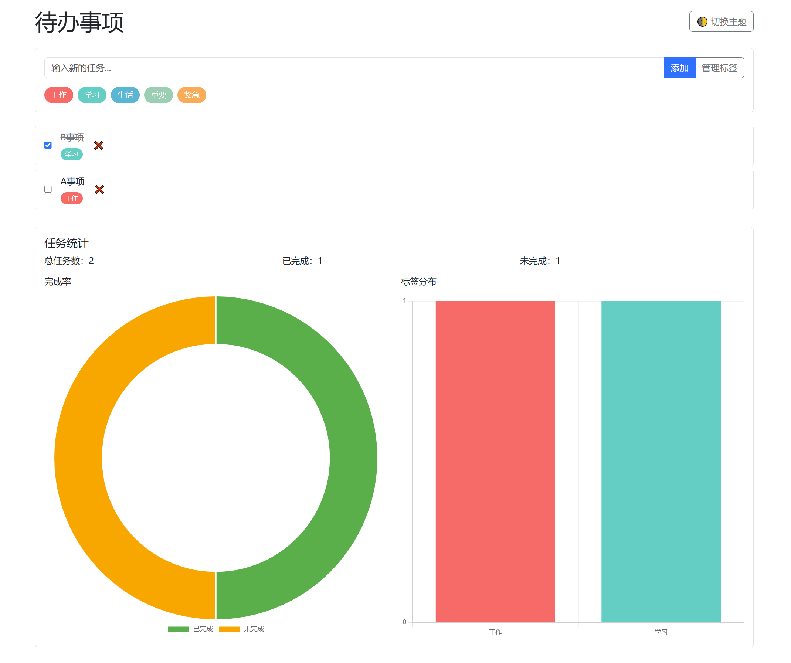

# 待办事项应用

一个功能丰富的任务管理Web应用，支持标签分类、数据统计和主题切换，基于原生JavaScript开发。



## 功能特性

- 📝 任务管理（增删改查、状态切换）
- 🏷️ 标签系统（自定义标签、颜色管理）
- 📊 数据统计（完成率图表、标签分布）
- 🌓 深色模式（自动适配系统主题）
- ⌨️ 快捷键支持（Ctrl+Enter快速添加）
- 📱 响应式布局（适配移动设备）
- 💾 本地存储（数据持久化）

## 使用说明

### 快速开始
1. 克隆仓库
```bash
git clone https://github.com/your-username/todo-app.git
```
2. 用浏览器打开 `index.html`

### 主要操作
- 添加任务：输入内容后点击添加或按 Ctrl+Enter
- 标签管理：通过"管理标签"按钮添加/编辑标签
- 主题切换：点击右上角🌓按钮切换亮/暗模式
- 任务统计：自动生成完成率和标签分布图表

## 技术栈
- **前端框架**: Bootstrap 5.3
- **图表库**: Chart.js 3.8
- **持久化**: LocalStorage
- **构建**: 纯原生JavaScript

## 项目结构
```
todo-app/
├── index.html        # 主界面
├── styles.css        # 样式文件
├── app.js            # 核心逻辑
└── README.md         # 说明文档
```

## 贡献指南
欢迎提交Issue和PR！建议步骤：
1. Fork项目
2. 创建功能分支 (`git checkout -b feature/your-feature`)
3. 提交修改 (`git commit -m 'Add some feature'`)
4. 推送分支 (`git push origin feature/your-feature`)
5. 新建Pull Request

## 许可证
[Apache-2.0 License](LICENSE)
