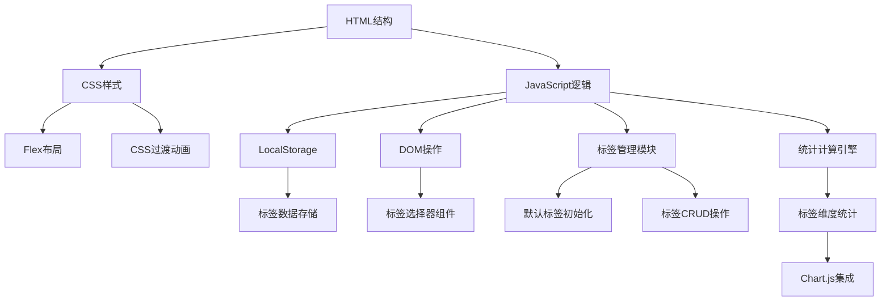

# 待办事项应用技术方案

## 核心功能
- 任务增删改查
- 本地数据持久化(LocalStorage)
- 任务状态切换（完成/未完成）
- 数据统计看板（新增标签维度）
- 响应式布局
- 标签分类管理

## 技术架构


## 技术选型
- vanilla HTML
- Bootstrap UI
- Chart.js 3.8.0

## 数据结构
```javascript
// 标签配置
{
  id: string,
  name: string,
  color: string, // HEX颜色代码
  isPreset: boolean
}

// 任务对象
{
  id: string, // UUID
  content: string,
  createdAt: timestamp,
  completed: boolean,
  tags: string[] // 标签ID数组
}
```

## 开发阶段
1. **基础功能版 (v0.1)** (已完成)
   - 核心任务管理功能
   - 基础样式框架
   - 数据持久化存储

2. **标签基础版 (v0.2)** (已完成)
   - 预设标签初始化
   - 任务标签绑定功能
   - 标签可视化展示组件

3. **管理增强版 (v0.3)** (已完成)
   - 标签增删改查界面
   - 标签颜色选择器
   - 标签数据校验

4. **统计分析版 (v0.4)** (已完成)
   - 标签维度统计面板
   - Chart.js图表集成
   - 完成率环形图表

5. **完整功能版 (v1.0)** (已完成)
   - 深色模式支持
   - 键盘快捷操作
   - 移动端优化
